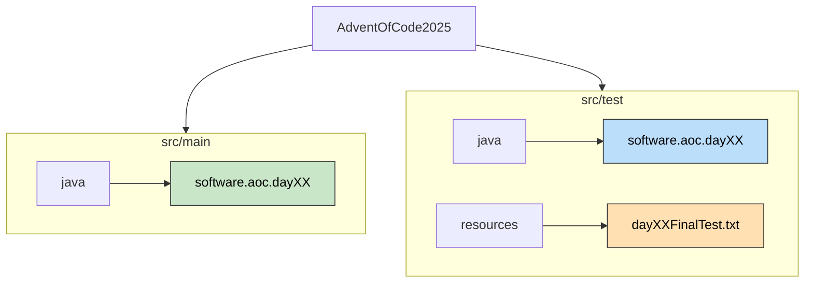

# Advent of Code 2025

Este repositorio contiene las soluciones para el [Advent of Code 2025](https://adventofcode.com/2025), implementadas en **Java 25**.
El proyecto sigue principios de **Clean Code**, **TDD** (Test Driven Development) y **SOLID** para asegurar un código robusto, legible y mantenible.

## Estructura del Proyecto

El código está organizado por días y partes (`a` para la Parte 1, `b` para la Parte 2), manteniendo la lógica de dominio separada de la infraestructura de pruebas.



---

## Estrategia de Pruebas y Validación

Seguimos una estrategia de pirámide de pruebas contenida dentro de cada paquete de desafío, asegurando tanto la corrección de los componentes pequeños como la solución final.

### 1. Código de Pruebas (`src/test/java`)

Cada día tiene su propia suite de pruebas (por ejemplo, `Day01ATest`), que agrupa diferentes niveles de verificación:

#### A. Tests Unitarios (Lógica de Dominio)
*   **Objetivo**: Verificar el comportamiento de clases individuales (`Dial`, `PlacementGenerator`, etc.) en aislamiento.
*   **Características**:
    *   Ejecución ultrarrápida (en memoria).
    *   Verifican reglas de negocio, inmutabilidad y casos borde.
    *   Ejemplo: Verificar que el `Dial` rota correctamente o maneja los límites (overflow).

#### B. Tests de Integración (Resolución del Puzzle)
*   **Objetivo**: Verificar que todos los componentes colaboran para resolver el input real del problema.
*   **Características**:
    *   Leen ficheros reales desde `src/test/resources`.
    *   Simulan el flujo completo: Parsing -> Procesamiento -> Solución.
    *   Verifican el resultado final contra la respuesta esperada.
    *   Métodos como `solvePuzzle()` o `testExampleScenario()`.

### 2. Recursos de Prueba (`src/test/resources`)

Aquí se almacenan los inputs del puzzle y archivos de ejemplo.
*   Estructura: `src/test/resources/dayXX/nombre_archivo.txt`
*   Acceso: Maven pone estos recursos en el classpath de prueba, accesibles mediante `InputReader` o `ClassLoader`.

---

## Cómo Ejecutar las Pruebas

El proyecto utiliza **Maven** y **JUnit 5**.

### Ejecutar Todo
Para correr la suite completa de todos los días:
```bash
mvn test
```

### Ejecutar un Día Específico
Para ejecutar solo los tests de un día o parte específica (ej. Día 1, Parte A):
```bash
mvn test -Dtest=Day01ATest
```

---

## Buenas Prácticas Implementadas

*   **Inmutabilidad**: Objetos de dominio (como `Dial`) son inmutables para prevenir efectos secundarios.
*   **Factory Methods**: Uso de métodos estáticos de fabricación (`Dial.createDefault()`, `Order.from()`) para mayor expresividad.
*   **Good Naming**: Los tests narran el comportamiento esperado (ej. `testDialRotationAndImmutability`).
*   **Modularidad**: Parsers, Modelos y Servicios están desacoplados.
*   **Clean Code**: Tanto el código de prueba como el código de producción esta organizado correctamente. No hay duplicación y las variables son claras.
