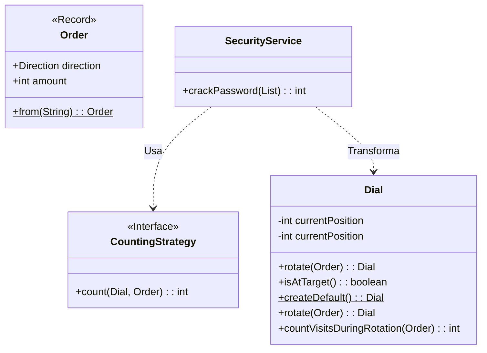

# Día 1: Acceso de Seguridad

## Descripción General del Problema
Este desafío nos sitúa frente a una puerta de seguridad con un dial circular. El objetivo es descifrar la combinación correcta basándonos en una serie de instrucciones de rotación (ej. "R50", "L10").

*   **Parte A**: Buscamos la posición final del dial tras una secuencia de movimientos.
*   **Parte B**: La seguridad aumenta y debemos monitorizar cuántas veces el dial cruza exactamente la posición cero durante su recorrido.

## Arquitectura y Diseño
El diseño se centra en la inmutabilidad y la programación funcional para gestionar el estado del dial sin efectos secundarios.

He aplicado el principio de **Responsabilidad Única (SRP)**:
*   **`Dial`**: Encapsula exclusivamente la lógica matemática del movimiento circular y la aritmética modular. Es un objeto inmutable; cada rotación crea un nuevo `Dial`.
*   **`Order`**: Un `record` que modela la intención del usuario (Dirección y Cantidad), parseando la entrada cruda de forma segura con un Factory Method.
*   **`SecurityService`**: Orquesta el flujo de datos. Transforma la lista de instrucciones en un estado final utilizando un reduce funcional.
*   **`CountingStrategy` (Parte B)**: Para la segunda parte, extraje la lógica de conteo a una estrategia, permitiendo cambiar cómo se puntúa el movimiento (solo al final vs. durante el recorrido) sin modificar la lógica core del `Dial`.

## Patrones de Diseño Utilizados

*   **Inmutabilidad**: `Dial` es inmutable. Esto permite usarlo en operaciones de reducción (`reduce` en Streams) sin efectos secundarios peligrosos. Cada paso del stream produce un estado completamente nuevo.
*   **Strategy Pattern (Patrón Estrategia)**: La diferencia fundamental entre la Parte A y la Parte B es el criterio de "Acierto".
    *   `simpleCheck()` (Parte A): ¿Acabé en 0?
    *   `continuousCheck()` (Parte B): ¿Pasé por 0 mientras giraba?
    *   Esto permite que `SecurityService` sea agnóstico a la regla de negocio concreta.
*   **Functional Programming**: Uso extensivo de `Stream.reduce` para acumular el estado (`DialState`) a través de la secuencia de órdenes.

## Detalles Técnicos
*   **Aritmética Modular**: Para manejar los límites circulares (0-99), utilizamos `Math.floorMod`. Esto maneja correctamente los giros a la izquierda (restas que dan negativo), envolviéndolos de vuelta al rango 99.
    *   Ejemplo: `(0 - 5) % 100` en Java estándar es `-5`. Con `floorMod` es `95`.

## Estrategia de Pruebas
Se crearon pruebas unitarias para validar la lógica de rotación y conteo de forma aislada.
*   **Unitarias**: `DialTest` verifica que la aritmética modular funciona en los bordes.
*   **Integración**: `Day01ATest` y `Day01BTest` verifican el flujo completo con inputs de ejemplo.

### Service (`service`)
*   **`SecurityService`**: Contiene la lógica de negocio de alto nivel. Coordina el parsing y la ejecución de órdenes sobre el `Dial` para obtener la solución final.

## Patrones de Diseño Utilizados

*   **Factory Method**: `Dial.createDefault()` y `Order.from(String)` centralizan la lógica de creación, permitiendo validaciones y un código cliente más limpio (`Order.from("R50")`).
*   **Immutable Object**: `Dial` es inmutable. Esto elimina una categoría entera de bugs relacionados con el estado compartido y permite que el `SecurityService` sea thread-safe por defecto.
*   **Strategy Pattern (Parte B)**: La interfaz `CountingStrategy` permite inyectar diferentes algoritmos de conteo en el servicio, cumpliendo con el principio Open/Closed.

## Elección de Tipos de Datos y Detalles Técnicos

*   **`DialState` (Record interno)**: Utilizo un acumulador inmutable (`dial` + `zeroCount`) para el `Stream.reduce`. Esto permite que toda la transformación de la lista de strings al resultado final sea una única tubería de operaciones funcionales pura.
*   **Aritmética Modular**: Para manejar las rotaciones a la izquierda correctamente en un espacio circular [0-99], uso `Math.floorMod`. A diferencia del operador `%` estándar de Java, `floorMod` maneja correctamente los números negativos, evitando errores cuando el dial cruza el 0 hacia atrás.

## Estrategia de Pruebas
La suite de pruebas (`Day01ATest` / `Day01BTest`) sigue la pirámide de pruebas:
1.  **Tests Unitarios (`DialTest`)**: Verifican la lógica de rotación y límites en aislamiento milimétrico.
2.  **Tests de Integración**: Prueban el `SecurityService` con los archivos de input reales (`day01FinalTest.txt`), asegurando que la orquestación completa funciona como se espera.