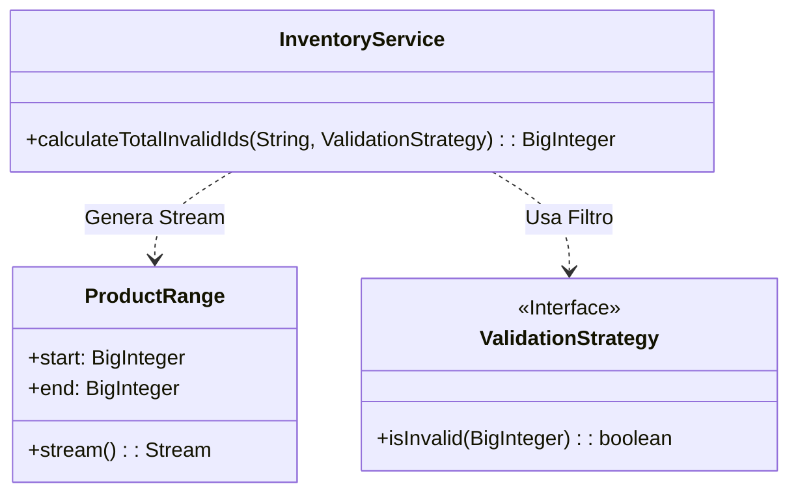

# Día 2: Gestión de Inventario

## Descripción General del Problema
En el almacén del Polo Norte, necesitamos validar una serie de rangos de identificadores de productos para encontrar cuáles están "corruptos" o mal etiquetados.
El problema nos da rangos numéricos muy grandes (ej. "1000000-2000000") y debemos buscar IDs que cumplan patrones específicos de repetición.

*   **Parte A**: Identificar IDs que consisten en la misma mitad repetida dos veces (ej. `123123`).
*   **Parte B**: Identificar IDs formados por *cualquier* sub-patrón repetido al menos dos veces para cubrir toda la longitud (ej. `121212`).

## Arquitectura y Diseño
Dado el volumen de los datos (rangos masivos), la eficiencia y la gestión de memoria son críticas.

He estructurado la solución separando la generación de datos de su validación:
*   **`ProductRange`**: Un `record` que representa el intervalo de búsqueda. Utiliza `Stream` para generar los IDs de forma perezosa (lazy evaluation), evitando cargar millones de números en memoria.
*   **`IdValidator` (Parte A) / `ValidationStrategy` (Parte B)**: Encapsulan puramente la lógica de "es este ID válido?". Son componentes sin estado (stateless).
*   **`InventoryService`**: Coordina el proceso. Toma los rangos, genera el stream de números y aplica el filtro del validador.

*   **`InventoryService`**: Orquesta el procesamiento de listas de rangos de entrada, utilizando el parser y el validador (o estrategia) para contar los elementos de interés.

## Patrones de Diseño Utilizados

*   **Strategy Pattern**: `ValidationStrategy` permite intercambiar la lógica de validación (Parte A vs Parte B) sin tocar el mecanismo de iteración del `InventoryService`.
*   **Iterator Pattern (vía Streams)**: Al usar `Stream.iterate`, procesamos los IDs uno a uno bajo demanda. Esto permite manejar rangos de tamaño arbitrario sin `OutOfMemoryError`.
*   **Value Object**: `ProductRange` y el uso de `BigInteger` garantizan que los datos de dominio sean inmutables y precisos.

## Elección de Tipos de Datos y Detalles Técnicos

*   **`BigInteger` para los IDs**: Decidí usar `BigInteger` en lugar de `long` o `int`.
    *   **Motivo**: Aunque los ejemplos iniciales son pequeños, los identificadores de inventario reales podrían exceder los 64 bits de un `long`. `BigInteger` ofrece precisión arbitraria y métodos seguros de matemática inmutable (`add`, `subtract`), protegiendo la solución a futuro.
*   **Validación de Patrones (Parte B)**: Para detectar repeticiones arbitrarias, implementé un algoritmo que busca divisores de la longitud del string. Si un ID tiene longitud 12, solo probamos sub-patrones de longitud 1, 2, 3, 4 y 6. Esto es mucho más eficiente que un enfoque de fuerza bruta o Regex complejos.

## Estrategia de Pruebas
*   **Unitarias**: `ValidationStrategyTest` verifica casos borde de strings (vacíos, impares, repeticiones parciales).
*   **Integración**: `Day02Test` carga los ficheros de recursos y valida el conteo total sobre los rangos de entrada reales.