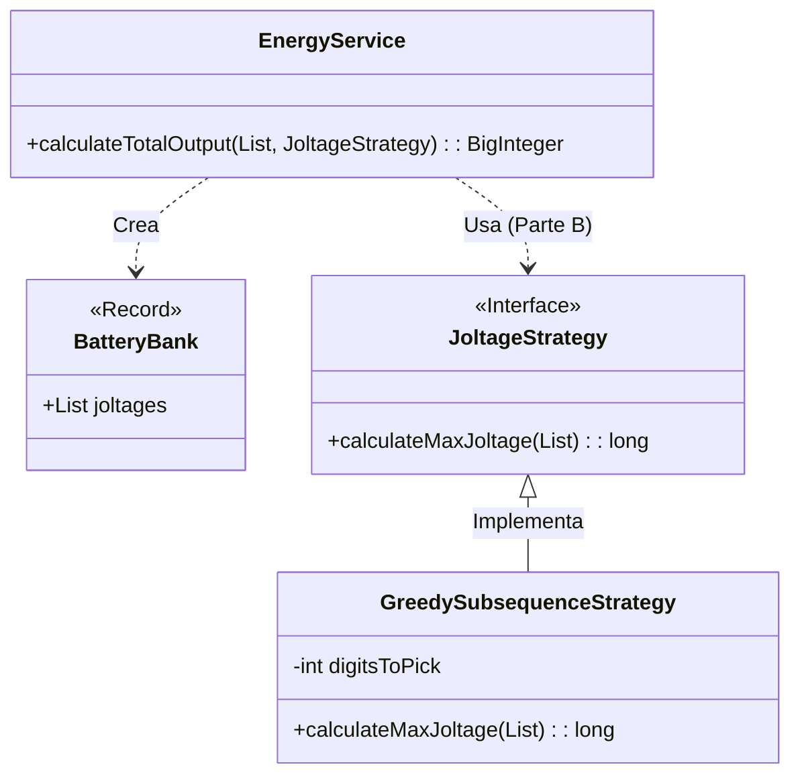

# Día 3: Crisis Energética

## Descripción General del Problema
Nos enfrentamos a un problema de optimización numérica sobre una serie de lecturas de sensores ("baterías").
El objetivo es encontrar la combinación de lecturas que maximice el voltaje, siguiendo reglas estrictas sobre el orden relativo de los dígitos.

*   **Parte A**: Encontrar el número más grande de 2 dígitos posible.
*   **Parte B**: Escalar el problema para encontrar el número más grande de 12 dígitos (subsecuencia), lo cual requiere un algoritmo mucho más eficiente que la fuerza bruta.

## Arquitectura y Diseño
He diseñado la solución centrándome en la **inmutabilidad** y la separación entre los datos puros y la lógica de selección.

*   **`BatteryBank`**: Un `record` inmutable que contiene los datos parseados. Actúa como un contenedor de dominio.
*   **`EnergyService`**: Orquesta el flujo `Input -> Parse -> Solve`. Es puramente funcional y sin estado.
*   **`JoltageStrategy` (Parte B)**: Encapsula el algoritmo de búsqueda. Esto permite cambiar la estrategia de "fuerza bruta" a "búsqueda optimizada/greedy" sin afectar al resto del sistema.

## Patrones de Diseño Utilizados

## Elección de Tipos de Datos

*   **`List<Integer>`**: Elegí listas inmutables para almacenar los dígitos. Esto facilita el uso de Streams y evita modificaciones accidentales del input original.
*   **`String` para el el resultado**: Como el resultado es una concatenación de dígitos que puede exceder el tamaño de un `long`, y lo que nos importa es la representación textual ("99..."), devolvemos un String.

## Estrategia de Pruebas
*   **Unitarias**: Verifican que `BatteryBank` se crea correctamente y que la estrategia voraz encuentra el máximo local y global en cadenas pequeñas de prueba.
*   **Integración**: `Day03Test` valida la solución completa contra los datasets de ejemplo y finales.