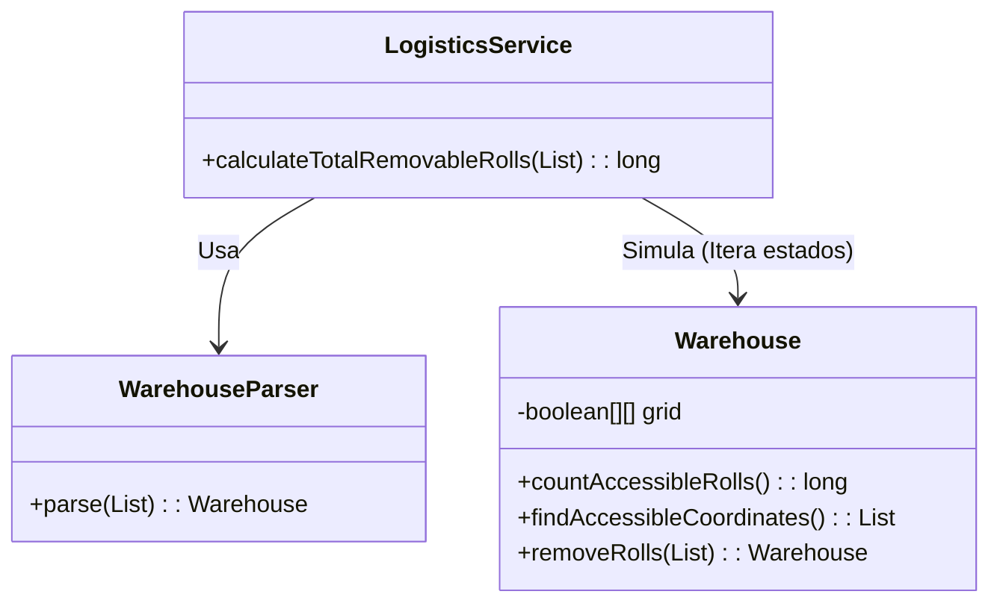

# Día 4: Gestión de Inventario (Simulación)

## Descripción General del Problema
Estamos gestionando un almacén 2D lleno de rollos de papel.
Necesitamos determinar qué rollos son accesibles para ser retirados por una carretilla elevadora (Forklift).

*   **Parte A**: Identificar cuántos rollos son accesibles desde el exterior *en el estado inicial*.
    *   Regla: Un rollo es accesible si tiene **menos de 4 vecinos** (de los 8 posibles, incluyendo diagonales).
*   **Parte B**: Simular el proceso de "pelar" el almacén.
    *   Al retirar los rollos accesibles, los que estaban detrás quedan expuestos.
    *   Debemos repetir el proceso hasta que no quede nada o nada sea accesible.

## Arquitectura y Diseño

### Model (`model`)
*   **`Warehouse`**: Encapsula la matriz booleana (`boolean[][]`) que representa el suelo del almacén.
    *   **Diseño Inmutable**: El método `removeRolls()` no modifica el array existente; devuelve una *nueva instancia* de `Warehouse` con los cambios aplicados. Esto facilita el razonamiento sobre el estado en cada paso de la simulación.
*   **`Coordinate`**: Record simple `(row, col)` para pasar posiciones.

### Service (`service`)
*   **`LogisticsService`**: Implementa la lógica de negocio (bucle de simulación).

## Patrones de Diseño Utilizados

*   **State Pattern (Evolución de Estado)**: Cada instancia de `Warehouse` representa el estado del sistema en un tiempo $t$.
*   **Inmutabilidad**: En lugar de mutar una matriz `grid` global, cada paso de la simulación produce un nuevo objeto `Warehouse`. Esto es más seguro para evitar condiciones de carrera lógicas durante la actualización (ej. borrar un vecino que aún necesitábamos consultar).
*   **Factory Method**: `Warehouse.from()` encapsula el parseo.

## Detalles Técnicos
*   **Vecindad de Moore**: Se comprueban las 8 direcciones (N, S, E, O, NE, NO, SE, SO).
*   **Representación del Grid**: `boolean[][]` es más eficiente en memoria y acceso ($O(1)$) que un `Set<Point>` para grids densos.

## Estrategia de Pruebas
*   **Unitarias**: Grid 3x3 para verificar accesibilidad (esquinas vs centro).
*   **Integración**: Ejecución completa del vaciado con el input grande.