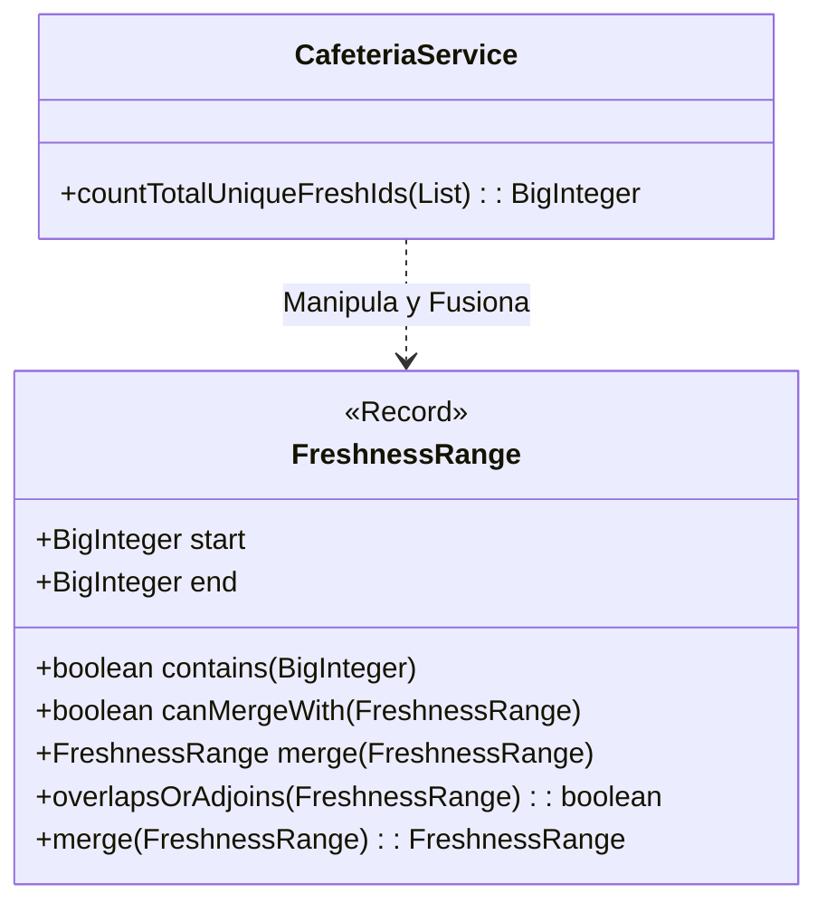

# Día 5: Semillas y Fertilizante

## Descripción General del Problema
Debemos comparar una serie de rangos de "frescura" de alimentos para determinar cuales son válidos o se solapan.
El problema implica trabajar con intervalos numéricos que pueden ser muy grandes, requiriendo lógica de conjuntos.

*   **Parte A**: Determinar si números específicos están contenidos dentro de una lista de rangos permitidos.
*   **Parte B**: Calcular la unión total de múltiples rangos, fusionando los que se solapan o son adyacentes, y contar los elementos únicos resultantes.

## Arquitectura y Diseño
La solución se basa en una gestión robusta de intervalos utilizando **Records** e **Inmutabilidad**.

*   **`FreshnessRange`**: Un `record` inmutable que encapsula un intervalo `[start, end]`.
    *   Implementa `Comparable<FreshnessRange>` para permitir ordenación eficiente.
    *   Contiene métodos de dominio como `contains(id)` y `overlaps(other)`.
*   **`CafeteriaService`**: Coordina la lógica. En la Parte B, implementa el algoritmo de fusión de intervalos.

## Desglose de Componentes

### Model (`model`)
*   **`FreshnessRange`**: Un `record` inmutable que encapsula un intervalo `[start, end]`.
    *   Implementa `Comparable` para ordenación (clave para Part B).
    *   Métodos de dominio ricos: `contains`, `merge`, `overlapsOrAdjoins`.

### Parser (`parser`)
*   **`RangeParser`**: Convierte strings de entrada en objetos de dominio.

### Service (`service`)
*   **`CafeteriaService`**: Coordina la lógica. Implementa el "Merge Intervals" sweep algorithm.

## Patrones de Diseño Utilizados

*   **Merge Intervals (Line Sweep Algorithm)**: Convertimos un problema de complejidad cuadrática $O(N^2)$ (comparar todos contra todos) en uno log-lineal $O(N \log N)$ al **Ordenar** primero los rangos. Esto permite fusionarlos en una sola pasada.
*   **Value Object / Rich Model**: `FreshnessRange` no es solo un DTO; contiene la lógica crítica de fusión e intersección, evitando un Servicio anémico.
*   **Inmutabilidad**: Todos los rangos son inmutables. `merge(other)` devuelve un *nuevo* rango.

## Detalles Técnicos
*   **BigInteger**: Necesario porque los identificadores pueden superar $2^{63}-1$.
*   **Adyacencia**: La fusión debe unir no solo rangos solapados (`[1-5]`, `[3-8]`), sino también adyacentes (`[1-5]`, `[6-10]`), ya que juntos forman un bloque continuo de frescura.

## Estrategia de Pruebas
*   **Unitarias (`FreshnessRangeTest`)**: Casos exhaustivos de geometría de intervalos 1D:
    *   Solapamiento parcial y total.
    *   Adyacencia exacta (+1).
    *   Rangos disjuntos.
*   **Integración**: Verificación con el dataset completo.