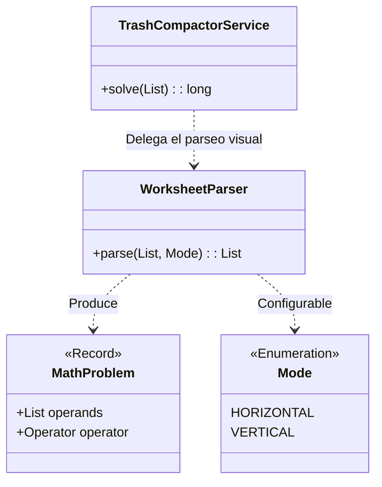

# Día 6: Compactador de Basura Espacial

## Descripción General del Problema
Este desafío nos presenta una hoja de cálculo con un formato inusual ("islas" de números separadas por columnas vacías). Debemos parsear estos bloques y realizar cálculos aritméticos básicos sobre ellos.

*   **Parte A**: Identificar bloques y sumar los números leyendo fila por fila.
*   **Parte B**: Leer los mismos bloques, pero esta vez analizando los números columna por columna (lectura vertical), lo cual requiere una estrategia de parseo más sofisticada.

## Arquitectura y Diseño
La complejidad principal reside en el parseo de la estructura visual del input.

*   **`WorksheetParser`**: El componente más complejo. Analiza la cuadrícula de caracteres para detectar "columnas vacías" que actúan como delimitadores. Divide el input en bloques lógicos (`ParsedBlock`).
    *   Soporta la inyección de un `ReadingMode` (HORIZONTAL vs VERTICAL) para reutilizar la lógica de segmentación.
*   **`MathProblem`**: Un `record` simple que representa una operación extraída (operandos + operador).
*   **`TrashCompactorService`**: Aplica la lógica de negocio (suma, resta, multiplicación) sobre los problemas extraídos.

## Desglose de Componentes

### Model (`model`)
*   **`MathProblem`**: (Record) Representa un problema matemático extraído visualmente, compuesto por una lista de operandos (números) y un operador (implícito o explícito).

### Parser (`parser`)
*   **`WorksheetParser`**: El componente central de la complejidad. Escanea la cuadrícula de texto para detectar "islas" de contenido separadas por columnas vacías y extrae los números, soportando lectura horizontal (A) y vertical (B).

### Service (`service`)
*   **`TrashCompactorService`**: Servicio que orquesta el proceso: invoca al parser con el modo adecuado (filas o columnas) y ejecuta las operaciones matemáticas sobre los problemas resultantes para obtener la suma total.

## Patrones de Diseño Utilizados

*   **Strategy Pattern (vía Enum Mode)**: El parser puede comportarse de dos formas distintas (leer filas o leer columnas) cambiando solo un parámetro (`Mode`). Esto evita duplicar la lógica de detección de bordes de bloques.
*   **Separation of Concerns**: El `Service` no sabe nada de coordenadas (x,y) ni de columnas vacías; solo recibe objetos `MathProblem` limpios. Toda la "suciedad" del formato visual está aislada en el `Parser`.

## Detalles Técnicos Interesantes

*   **Detección de Islas**: El parser primero escanea verticalmente para encontrar columnas que están totalmente vacías. Estas columnas sirven como fronteras para recortar las sub-matrices (bloques) que contienen los problemas matemáticos.
*   **Lectura Vertical**: Para la Parte B, en lugar de trasponer la matriz físicamente (costoso en memoria), simplemente cambiamos los índices de iteración (`x` varía antes que `y`) al construir los números.

## Estrategia de Pruebas
*   **Unitarias**: `WorksheetParserTest` es vital aquí. Prueba casos con múltiples bloques, bloques de diferentes tamaños y bloques separados por varias columnas vacías.
*   **Integración**: `Day06Test` verifica el flujo completo desde el archivo de texto hasta el resultado numérico final.