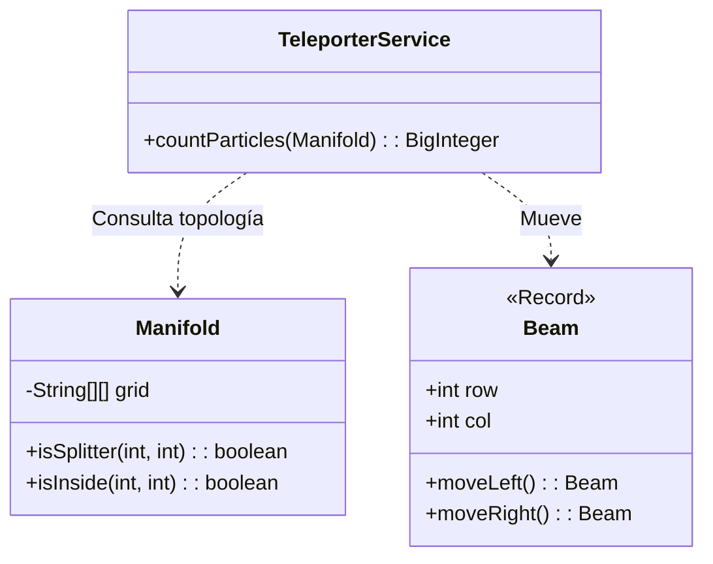

# Día 7: Teletransportación Cuántica

## Descripción General del Problema
Simulamos el movimiento de partículas (haces de luz) en una red que contiene divisores (`^`).
El desafío es predecir dónde terminan las partículas o cuántas hay en un momento dado, considerando que los divisores multiplican las partículas exponencialmente.

*   **Parte A**: Simulación paso a paso de haces individuales en un espacio discreto.
*   **Parte B**: Simulación a gran escala donde el número de partículas explota exponencialmente (2^N), requiriendo un cambio fundamental en el modelo de datos.

## Arquitectura y Diseño
He separado la estructura estática del entorno (`Manifold`) de la dinámica de las partículas (`Beam` / `TeleporterService`).

*   **`Manifold`**: Representa la "variedad" o tablero 2D. Es una estructura de solo lectura que encapsula la topología (dónde hay divisores, límites de la red).
*   **`Beam`**: Un `record` inmutable que modela el estado (posición y vector) de una partícula.
*   **`TeleporterService`**: Implementa la lógica de evolución temporal.

## Desglose de Componentes

### Model (`model`)
*   **`Beam`**: (Record) Representa una partícula o haz de luz individual (posición y dirección). Usado en la simulación discreta de la Parte A.
*   **`Manifold`**: Representa la estructura del "mundo" o red de divisores. Es inmutable y permite consultas topológicas.

### Parser (`parser`)
*   **`ManifoldParser`**: Convierte el mapa ASCII en una estructura `Manifold`.

### Service (`service`)
*   **`TeleporterService`**: Contiene la lógica dual: Simulación paso a paso con Sets para la Parte A, y Agregación de Estados (DP) con Mapas de conteo (`BigInteger`) para la Parte B.

## Patrones de Diseño Utilizados

*   **Dynamic Programming (Programación Dinámica / Agregación)**: En la Parte B, es imposible simular cada partícula individualmente. En su lugar, utilizo un **Histograma de Estado** (`Map<Columna, Cantidad>`). Proceso el tablero fila a fila, calculando cuántas partículas llegan a cada columna basándome en la fila anterior. Esto reduce la complejidad de exponencial a polinómica.
*   **Immutability**: `Beam` es inmutable, simplificando la lógica de bifurcación (un padre genera dos hijos nuevos).

## Detalles Técnicos Interesantes

*   **Explosión de Estados**: El uso de `BigInteger` en la Parte B es obligatorio, ya que los conteos superan rápidamente la capacidad de un `long`.
*   **Grafo Acíclico Dirigido (DAG)**: Dado que las partículas siempre descienden (fila + 1), no hay ciclos. Esto permite procesar la simulación como una cascada lineal sin necesidad de algoritmos de detección de ciclos complejos.

## Estrategia de Pruebas
*   **Unitarias**: `BeamTest` verifica el movimiento correcto. `ManifoldTest` asegura que el grid se carga bien.
*   **Integración**: `Day07Test` prueba casos pequeños (pocas filas) donde se puede verificar el conteo manualmente, y luego el caso masivo.