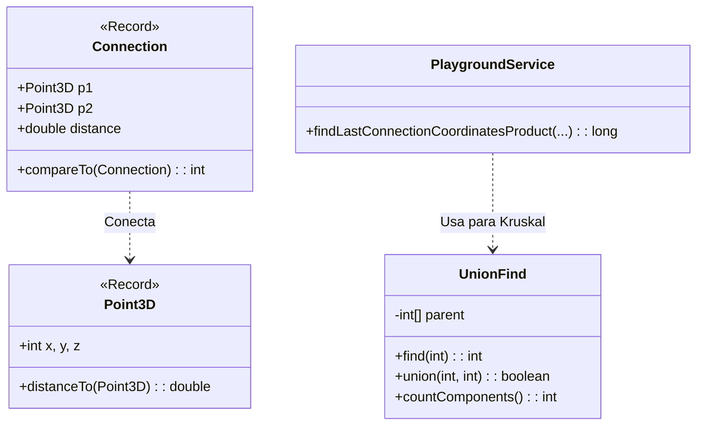

# Día 8: Problema de Parada (Teoría de Grafos)

## Descripción General del Problema
Este problema se modela perfectamente como un ejercicio de teoría de grafos. Tenemos una serie de nodos ("antenas") en un espacio 3D y debemos conectarlos minimizando costes o encontrando enlaces críticos.

*   **Parte A**: Generar una red parcialmente conectada (las K conexiones más cortas) y analizar los componentes conexos resultantes.
*   **Parte B**: Encontrar la "arista crítica" que unifica todo el sistema en un solo componente conexo. Esto es equivalente a encontrar la última arista añadida en un algoritmo de Árbol de Expansión Mínima (MST).

## Arquitectura y Diseño
La solución gira en torno a estructuras de datos eficientes para grafos densos.

*   **`Point3D`**: Un `record` para coordenadas espaciales.
*   **`Connection`**: Representa una arista ponderada entre dos puntos. Implementa `Comparable` para ordenar por distancia (peso).
*   **`UnionFind` (Disjoint Set Union - DSU)**: Estructura de datos fundamental para gestionar conjuntos disjuntos de forma ultra-eficiente. Permite verificar si dos nodos ya están conectados y unirlos casi en tiempo constante.

## Desglose de Componentes

### Model (`model`)
*   **`Point3D`**: (Record) Coordenada geométrica (x, y, z) con utilidades de cálculo de distancia.
*   **`Connection`**: (Record) Arista ponderada que une dos `Point3D` con un coste (distancia). Comparable.
*   **`UnionFind`**: Clase que implementa la estructura de datos DSU (Disjoint Set Union) con optimizaciones de Path Compression y Union by Rank.

### Parser (`parser`)
*   **`PointParser`**: Parsea la lista de coordenadas de entrada.

### Service (`service`)
*   **`PlaygroundService`**: Ejecuta el algoritmo de Kruskal para conectar los componentes y resolver el problema de minimización de costes.

## Patrones de Diseño Utilizados

*   **Algoritmo de Kruskal**: Implementación clásica para encontrar el MST. Ordenamos todas las aristas posibles por distancia y las vamos añadiendo si conectan dos componentes previamente separados.
*   **Data Structure Encapsulation**: La complejidad de la gestión de componentes (`rank`, `path compression`) está totalmente oculta dentro de la clase `UnionFind`. El servicio solo llama a `union()` y `countComponents()`.

## Detalles Técnicos Interesantes

*   **Path Compression (Compresión de caminos)**: Optimización en `UnionFind`. Al buscar la raíz de un nodo, conectamos todos los nodos visitados directamente a la raíz, aplanando el árbol y acelerando futuras búsquedas.
*   **Geometría 3D**: La distancia se calcula usando la métrica Euclídea estándar `sqrt(dx^2 + dy^2 + dz^2)`.

## Estrategia de Pruebas
*   **Unitarias**: `UnionFindTest` verifica que la estructura une componentes correctamente y reduce el conteo de componentes disjuntos paso a paso.
*   **Integración**: `Day08Test` genera grafos aleatorios y verifica que el algoritmo siempre converge a 1 solo componente al final (red conectada).