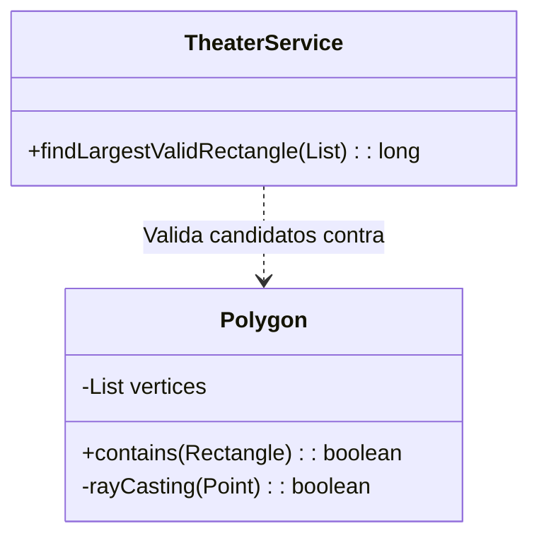

# Día 9: Configuración del Teatro (Geometría Computacional)

## Descripción General del Problema
Un problema de optimización geométrica. Dado un polígono irregular (el teatro), debemos inscribir rectángulos dentro de él para maximizar el área de asientos.

*   **Parte A**: Fuerza bruta sobre pares de vértices para encontrar el rectángulo de área máxima, sin validar límites.
*   **Parte B**: Validación geométrica estricta. El rectángulo candidato debe estar **completamente contenido** dentro del polígono irregular, sin cruzar sus bordes.

## Arquitectura y Diseño
Separación clara entre primitivas geométricas y lógica de negocio.

*   **`Tile`**: Representa un vértice `(x, y)`. Inmutable.
*   **`Polygon`**: Encapsula la definición del polígono y las reglas de contención complejas (`intersects`, `contains`).
*   **`TheaterService`**: Implementa el bucle de optimización (selección de candidatos).

## Desglose de Componentes

### Model (`model`)
*   **`Tile`**: (Record) Punto básico 2D (x, y). Representa los vértices del teatro.
*   **`Polygon`**: Entidad compleja que gestiona la lista de vértices y contiene la lógica geométrica avanzada: intersección de segmentos y algoritmo Ray Casting ("Point in Polygon").

### Parser (`parser`)
*   **`TileParser`**: Analiza el input textual para construir la lista de vértices `Tile` que definen el perímetro del teatro.

### Service (`service`)
*   **`TheaterService`**: Se encarga de la búsqueda de fuerza bruta optimizada (Greedy/Pruning), iterando sobre pares de vértices para encontrar el rectángulo válido de mayor área.

## Patrones de Diseño Utilizados

*   **Encapsulación**: La clase `Polygon` actúa como una fachada para algoritmos geométricos complejos (Intersección de segmentos, Ray Casting), manteniendo el servicio limpio y legible.
*   **Object-Oriented Design**: Cada entidad geométrica (`Segment`, `Tile`, `Polygon`) tiene su responsabilidad clara, evitando "Primitive Obsession" (usar arrays sueltos de ints para todo).

## Detalles Técnicos Interesantes

*   **Algoritmo Ray Casting (Point in Polygon)**: Para saber si un rectángulo está dentro, verificamos su centroide. Lanzamos un rayo imaginario desde el centro hacia el infinito; si cruza un número impar de bordes del polígono, está dentro. Si es par, está fuera.
*   **Validación de Intersección**: Además de comprobar el centro, verificamos que ningún lado del rectángulo cruce ningún lado del polígono.
*   **Optimización**: Ordenamos o filtramos los candidatos por área descendente. En cuanto encontramos uno válido geométricamente, paramos (Greedy/Pruning), evitando validaciones costosas en rectángulos pequeños.

## Estrategia de Pruebas
*   **Unitarias**: `PolygonTest` cubre casos críticos como polígonos cóncavos ("formas de U") donde el centroide podría caer fuera aunque los vértices toquen el borde.
*   **Integración**: `Day09Test` utiliza formas complejas para asegurar que no se aceptan soluciones inválidas que "se salen" de las paredes.