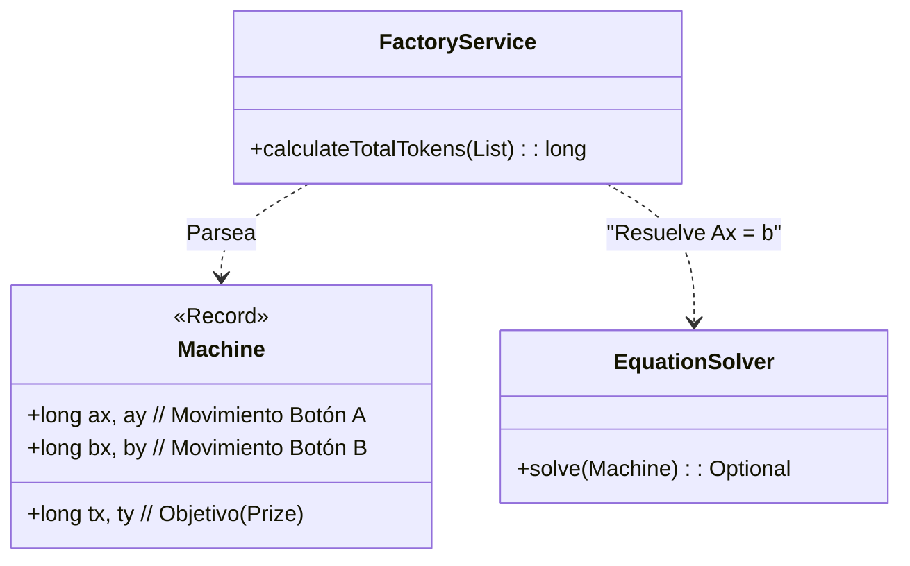

# Día 10: Tubo de Rayos Catódicos (Álgebra Lineal)

## Descripción General del Problema
Este problema nos lleva a un arcade donde las máquinas de premios (Garra) se comportan de una forma matemáticamente predecible.
Cada botón (A y B) mueve la garra una cantidad fija en los ejes X e Y. El objetivo es alinear la garra exactamente sobre un premio.

*   **Parte A**: Encontrar la combinación de pulsaciones más barata (Botón A cuesta 3, B cuesta 1) para un objetivo alcanzable en pocas pulsaciones (<100).
*   **Parte B**: Los objetivos se mueven a coordenadas inmensas (10 billones), haciendo imposible la simulación o fuerza bruta. Se requiere una solución analítica exacta.

## Arquitectura y Diseño
He dividido la implementación en modelado matemático puro y lógica de negocio.

*   **`Machine`**: Representa una máquina individual (coeficientes de movimiento y target).
*   **`EquationSolver`**: Un componente matemático que resuelve sistemas de ecuaciones lineales de 2x2.
*   **`FactoryService`**: Lee el input y delega cada máquina al solver.



## Desglose de Componentes

### Model (`model`)
*   **`Machine`**: (Record) Encapsula los parámetros de una máquina Arcade: coordenadas de movimiento para los botones A y B, y la ubicación del premio.

### Parser (`parser`)
*   **`MachineParser`**: Extrae los coeficientes numéricos (X, Y) del texto de entrada usando expresiones regulares.

### Service (`service`)
*   **`FactoryService`**: Contiene la lógica matemática (Regla de Cramer / sistema de ecuaciones 2x2) para determinar el número exacto de pulsaciones requeridas, validando que sean soluciones enteras y no negativas.

## Patrones de Diseño Utilizados

*   **Mathematical Modeling (Modelado Matemático)**: En lugar de tratar esto como un problema de búsqueda (BFS), lo modelé como un sistema de ecuaciones lineales:
    ```
    A_x * a + B_x * b = Target_X
    A_y * a + B_y * b = Target_Y
    ```
    Esto permite resolverlo en tiempo constante O(1) usando la Regla de Cramer o sustitución simple, independientemente de cuán grandes sean los números (Parte B).

## Detalles Técnicos Interesantes

*   **Precisión Entera**: Aunque es un sistema lineal, solo nos interesan las soluciones enteras no negativas. El solver verifica si la división (determinante) es exacta.
*   **Complejidad**: Pasamos de O(N) o O(Target) en una búsqueda ingenua a O(1) matemático pura.

## Estrategia de Pruebas
*   **Unitarias**: `EquationSolverTest` verifica sistemas con solución única, sin solución (líneas paralelas) y soluciones no enteras.
*   **Integración**: `Day10Test` valida la suma total de tokens contra los ejemplos provistos.