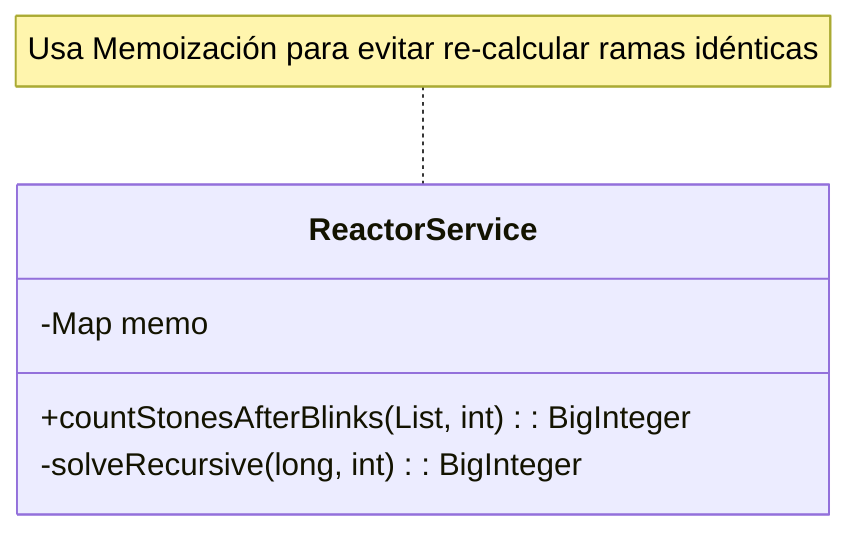

# Día 11: Generadores Termoeléctricos (Grafos y DP)

## Descripción General del Problema
Debemos analizar la conectividad de una red de reactores o piedras que cambian de estado.
El problema se reduce a contar caminos o transformaciones a través de un grafo dirigido acíclico (DAG) que representa la evolución del sistema.
La explosión combinatoria de caminos requiere técnicas avanzadas de conteo.

*   **Parte A**: Simulación directa o conteo recursivo simple para pocos pasos.
*   **Parte B**: Conteo de caminos o transformaciones a gran escala (ej. 75 pasos), donde el número de entidades resultantes supera la capacidad de ram física.

## Arquitectura y Diseño
La solución utiliza **Memoización** (Programación Dinámica Top-Down) para cachear resultados intermedios.

*   **`Network` / `Graph`**: Define las reglas de transición (qué número genera qué otros números).
*   **`ReactorService`**: Implementa el algoritmo de conteo recursivo con caché.
    *   Método clave: `countProgeny(stoneValues, stepsRemaining)`.

## Desglose de Componentes

### Model (`model`)
*   **`Network`**: (Class) Representación del sistema de reactores como un grafo dirigido (Lista de Adyacencia). Permite consultar las conexiones salientes de cada dispositivo.

### Parser (`parser`)
*   **`NetworkParser`**: Convierte la lista de conexiones textuales (ej. "A -> B, C") en un objeto `Network` estructurado.

### Service (`service`)
*   **`ReactorService`**: Implementa el algoritmo de conteo de caminos (DFS + Memoization) para determinar cuántas rutas distintas existen desde el inicio ("you") hasta la salida ("out").

## Patrones de Diseño Utilizados

*   **Memoization (Caché)**: Almacenamos el resultado de `(valor, pasosRestantes)` en un Mapa. Como los mismos números tienden a repetirse y converger (ej. 0 -> 1 -> 2024...), el número de sub-problemas únicos es manejable, aunque el árbol de recursión total sea inmenso.
*   **Divide y Vencerás**: El problema de "cuántas piedras generarán 5 piedras iniciales" se divide en 5 problemas independientes de "cuántas piedras generará 1 piedra inicial", y sumamos los resultados.

## Detalles Técnicos Interesantes

*   **BigInteger**: Imprescindible. El número total de piedras crece exponencialmente y desborda un `long` de 64 bits en la Parte B.
*   **Optimización**: El árbol de recursión se poda masivamente gracias a la caché. Un cálculo que tomaría eones se resuelve en milisegundos.

## Estrategia de Pruebas
*   **Unitarias**: Verifican las reglas de transición individuales (ej. regla del número par de dígitos).
*   **Integración**: `Day11Test` comprueba que el algoritmo coincide con la simulación en pasos bajos (Part A) y devuelve un resultado plausible en pasos altos (Part B).