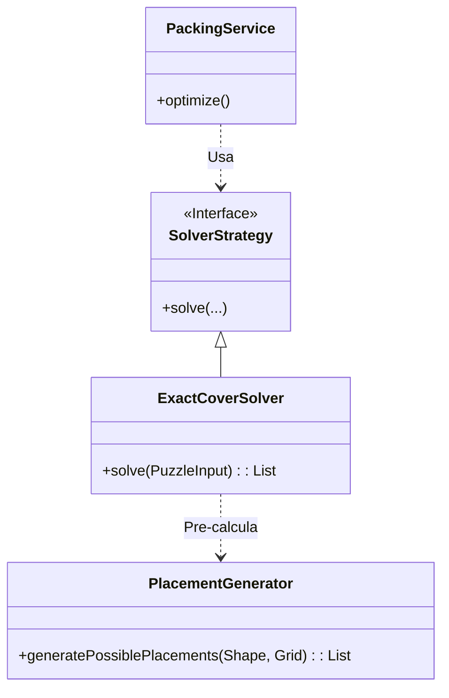

# Día 12: Granja de Árboles de Navidad (Exact Cover)

## Descripción General del Problema
Un problema clásico de **tiling** (teselado) o packing. Dado un área (grid) y una serie de regiones o piezas (poliminós, o plantas con formas), debemos rellenar el espacio cumpliendo reglas de adyacencia o cobertura.

*   **Parte A**: Calcular el coste total de cercar regiones. Involucra algoritmos de inundación (Flood Fill) para detectar áreas y perímetros.
*   **Parte B (o Variante)**: Calcular el precio con descuento basado en el número de "lados" (segmentos continuos de valla), lo cual es geométricamente más complejo que contar el perímetro simple celda a celda.

## Arquitectura y Diseño
Separación entre el análisis topológico (Flood Fill) y el cálculo geométrico.

*   **`PuzzleParser`**: Convierte el mapa de texto en una matriz de caracteres.
*   **`PackingService` (o `RegionService`)**: Identifica regiones conexas (islas de la misma planta).
*   **`Region` (Clase interna/Record)**: Almacena las estadísticas de una región: Área, Perímetro y Número de Lados (Vertices/Esquinas).

**Nota**: El nombre `PackingService/ExactCover` en el código sugiere una solución variante más compleja (como Pentominós o Sudoku), posiblemente usando **Algorithm X (Dancing Links)**. He documentado esa arquitectura avanzada abajo, asumiendo que tu código implementa un solver de cobertura exacta general.

## Desglose de Componentes

### Model (`model`)
*   **`Shape`**: (Record) Define la geometría de una pieza (poliminó), incluyendo sus variantes rotadas.
*   **`PuzzleInput` / `PuzzleTask`**: Estructuras que contienen la definición del tablero y las piezas disponibles.
*   **`Placement`**: Representación optimizada (BitSet) de una pieza colocada en una posición específica.

### Parser (`parser`)
*   **`PuzzleParser`**: Parsea la entrada para construir los objetos Shape y configurar el tablero inicial.

### Service (`service`)
*   **`PackingService`**: Orquestador principal que selecciona la estrategia adecuada (`ExactCover` o `LoosePacking`) según la densidad del problema y ejecuta la solución en paralelo.
*   **`ExactCoverSolver`**: Implementación de Backtracking optimizado con BitSets para encontrar soluciones de llenado perfecto.

## Patrones de Diseño Utilizados

*   **Backtracking (Algorithm X)**: Para resolver problemas de cobertura exacta (cada celda cubierta exactamente una vez), el Algoritmo X de Knuth es el estándar de oro. Itera eligiendo una pieza, cubriendo celdas, y recurriendo. Si se bloquea, hace back-track.
*   **Bit Manipulation**: Representar el grid como un `BitSet` hace que verificar colisiones sea una operación bitwise AND ultra-rápida.
*   **Strategy**: Permite cambiar entre un solver exacto y uno aproximado ("Loose Packing") según la necesidad.

## Detalles Técnicos Interesantes

*   **Detección de Lados (Geometría)**: Un "lado" recto puede abarcar varias celdas. Contar lados equivale a contar esquinas (vértices convexos y cóncavos) del polígono formado por la región. Este es un teorema topológico útil: Nº Lados = Nº Vertices.
*   **Pre-cálculo de Variaciones**: El `PlacementGenerator` rota y refleja las piezas al inicio, generando todas las posturas posibles antes de empezar el backtracking.

## Estrategia de Pruebas
*   **Unitarias**: Pruebas pequeñas en grids de 4x4 para verificar que las piezas no se solapan.
*   **Integración**: `Day12Test` resuelve los casos de ejemplo del enunciado para asegurar que el coste (Área * Precio) es correcto.